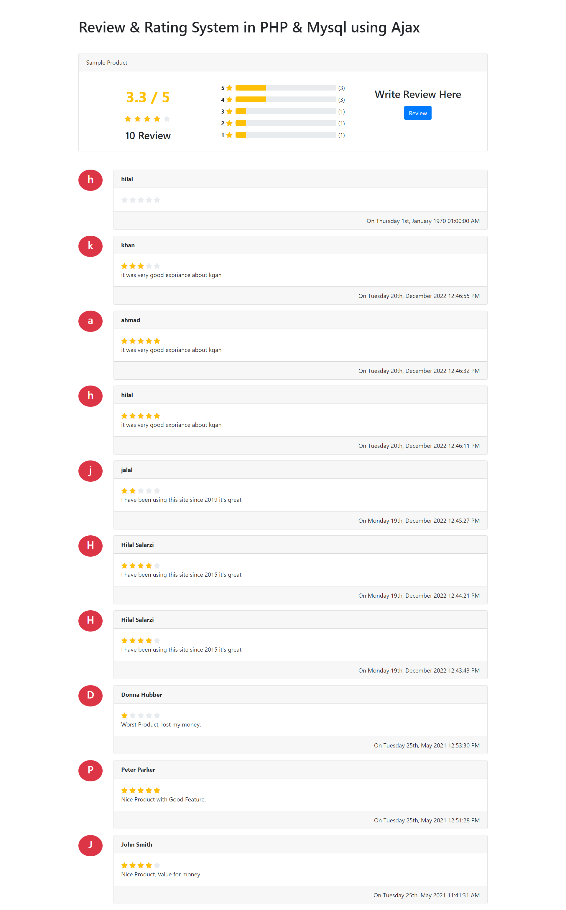

    # Star Review

 <!-- You can add an image or screenshot of your project here -->

The Star Review project is a web application that allows users to provide star ratings and reviews for various products, services, or items. It provides an intuitive interface for users to express their opinions using star ratings, making it an effective way to gather valuable feedback and opinions.

## Key Features

- **Star Ratings:** Users can rate items or services using a star-based rating system, allowing for quick and easy feedback.

- **Review Comments:** Users can optionally leave comments or reviews explaining their rating decisions.

- **Multiple Categories:** The application supports multiple categories, making it suitable for diverse use cases such as product reviews, restaurant ratings, and more.

- **Responsive Design:** The user interface is responsive and works seamlessly across various devices, including desktops, tablets, and mobile phones.

- **PHP & MySQL with Ajax:** The project is built using PHP and MySQL for backend processing and database management. Ajax is utilized to enable smooth and asynchronous interactions between the user interface and the server, enhancing the user experience.

## Getting Started

To explore the Star Review application, simply visit the website:

[https://techodu.com.com](https:techodu.com)

## Technologies Used

- HTML5, CSS3, Bootstrap
- JavaScript, jQuery, Ajax
- PHP, MySQL

## Screenshots

<!-- Add more screenshots if applicable -->

## Contributions

Contributions are welcome! If you find any issues with the application or want to add new features, feel free to open a pull request.

## License

This project is licensed under the [MIT License](LICENSE).

---

Thank you for exploring the Star Review application! If you have any questions or feedback, feel free to contact me.

[LinkedIn](https://www.linkedin.com/in/hilalsalarzi)
[Email](mailto:hilalahamdsalarzi@gmail.com)
[GitHub](https://github.com/hilalsalarzi)
[Facebook](https://www.facebook.com/hilalsalarzi)
[Instagram](https://www.instagram.com/hilalsalarzi)
